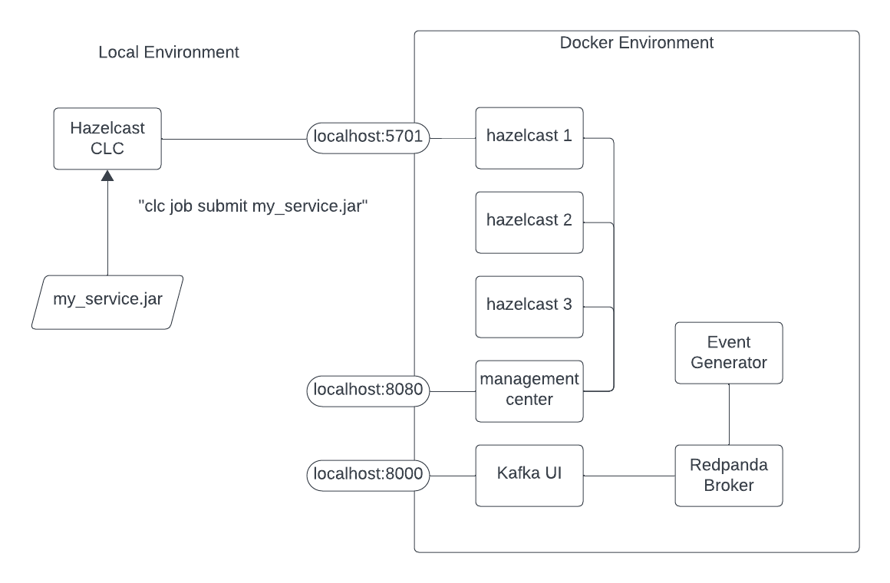
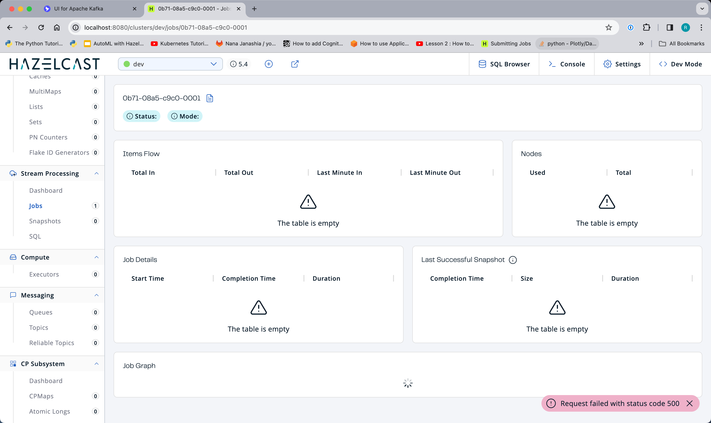

# Overview 

I encountered a problem with MC not displaying my job graph.  This is a repro.

# Prerequisites 

You will need a development laptop with the following installed:
- Docker Desktop
- A functional Java IDE
- Maven
- __Hazelcast Command Line Client (CLC)__

To install Hazelcast CLC, see: https://docs.hazelcast.com/clc/latest/install-clc

# Overview of the Environment

Most of the components of this lab run within an isolated Docker environment. To allow 
you to interact with the components from outside the Docker environment some 
components are exposed on localhost ports.  For example, when you run CLC it will 
connect to one of the Hazelcast instances via `localhost:5701`.  The diagram below 
should help to clarify the situations.



# Steps

```shell
mvn clean install
docker compose up -d
clc config add docker cluster.name=dev cluster.address=localhost:5701
```

Pull up management center: http://localhost:8080

Now deploy the job.
```shell
clc -c docker  job submit fraud-pipelines/target/fraud-pipelines-1.0-SNAPSHOT.jar redpanda:9092 transactions approvals --class hazelcast.platform.labs.payments.FraudPipeline
```

Try to view it in MC.



