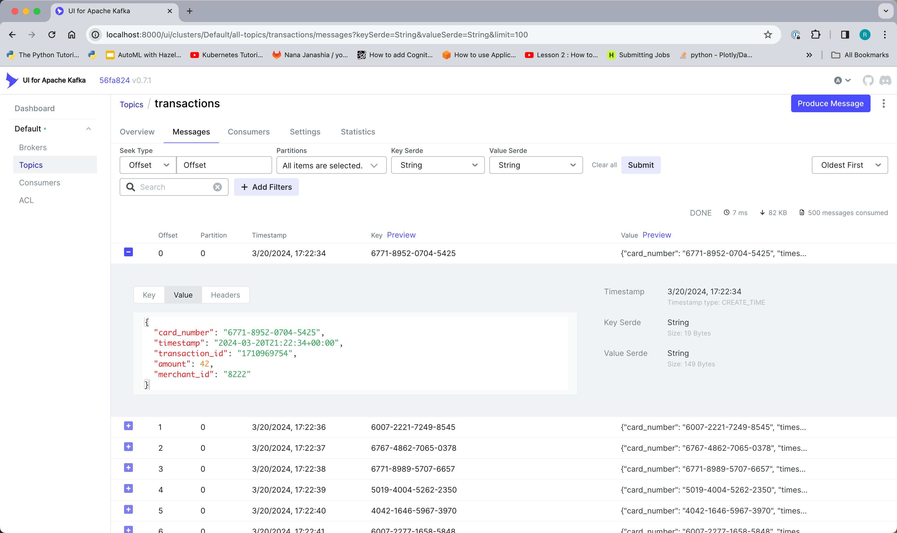
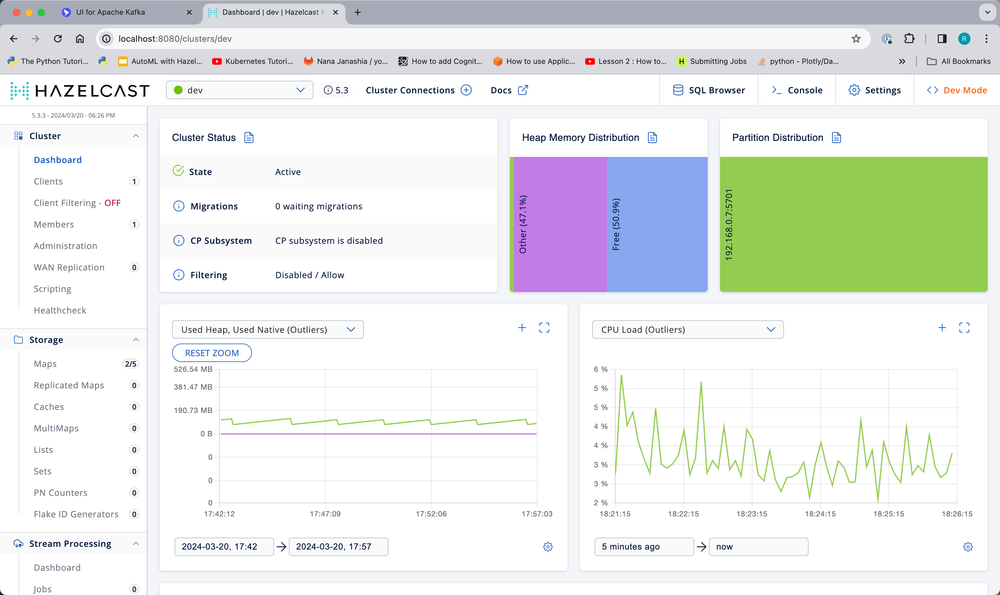

# Overview 

The purpose of this lab is to show you how to implement event-driven microservices using the Hazelcast platform.

Event-driven microservices have the following basic properties:
- they implement a cohesive "chunk" of business functionality 
- they are deployable components
- they consume and emit events 

_Pipelines_, a part of the Hazelcast platform, exhibit all 3 characteristics. In other words, Pipelines are 
how Hazelcast implements event-driven microservices.  In this lab, you will learn:
- [ ] how to implement an event-driven microservice by writing a Pipeline 
- [ ] how to deploy your service to the Hazelcast platform
- [ ] how to scale your service 
- [ ] how to update your service  
- [ ] how to take advantage of the fast data store that is built in to the platform
- [ ] how to incorporate python code into your service 
- [ ] as a bonus, you will learn how traditional REST microservices can be implemented with Hazelcast Pipelines

Let's get started ...

# Prerequisites 

You will need a development laptop with the following installed:
- Docker Desktop
- A functional Java IDE
- Maven
- __Hazelcast Command Line Client (CLC)__

To install Hazelcast CLC, see: https://docs.hazelcast.com/clc/latest/install-clc

# Overview of the Environment

Most of the components of this lab run within an isolated Docker environment. To allow 
you to interact with the components from outside the Docker environment some 
components are exposed on localhost ports.  For example, when you run CLC it will 
connect to one of the Hazelcast instances via `localhost:5701`.  The diagram below 
should help to clarify the situations.


# Lab 0: Verify the environment

To start the lab environment, run the following from a command line:  
> `docker compose up -d`

Let's connect the Hazelcast CLI to the Hazelcast instance running in docker.

> ```
> clc config add docker cluster.name=dev cluster.address=localhost:5701
>  OK Created the configuration at: /Users/rmay/.hazelcast/configs/docker/config.yaml
> ```

This command saves the cluster connection information in a configuration file as shown 
in the output.  In this case, "docker" is the name of the configuration we have 
created.  In subsequent commands, use the "-c" flag to designate a named configuration.
Verify your new configuration is valid using the following command.

> ```
> clc -c docker  job list
> OK No jobs found.
> ```

Use the Kafka UI at  http://localhost:8000 to inspect the messages in the "transactions"
topic.



You can also access the Hazelcast Management Center at http://localhost:8080 



# Lab 1: Deploy a Service 

For this lab the pipeline has already been built for you.  It simply reads every 
message from the "transactions" topic and publishes an approval on the "approvals" 
topic.  It does no fraud detection at all!


Check out the code in `hazelcast.platform.labs.payments.AuthorizationPipeline` 

Build and deploy the Pipeline. From a command prompt in the project root directory run:
```shell
mcn clean install
clc -c docker  job submit fraud-pipelines/target/fraud-pipelines-1.0-SNAPSHOT.jar redpanda:9092 transactions approvals --class hazelcast.platform.labs.payments.AuthorizationPipeline
```

To verify it worked, check the "Jobs" section of Hazelcast Management Center (http://localhost:8080) 
and also use the Kafka UI (http://localhost:8000) to see that there are messages in the "approvals" topic.

You can also use CLC to check the status of the job:
```shell
clc -c docker  job list
 Job ID              | Name          | Status  | Submitted           | Completed
 0b6d-f591-2180-0001 | Fraud Checker | RUNNING | 2024-03-22 11:50:01 | -
```

### progress check
- [ ] how to implement an event-driven microservice by writing a Pipeline
- [x] how to deploy your service to the Hazelcast platform
- [ ] how to scale your service
- [ ] how to update your service while it is running
- [ ] how to take advantage of the fast data store that is built in to the platform
- [ ] how to incorporate python code into your service
- [ ] as a bonus, you will learn how traditional REST microservices can be implemented with Hazelcast Pipelines

# Lab 2: Modify the Service

Let's start with a simple rule.  If the transaction amount is over 


# Just thinking out loud

You're not supposed to update external things in something that's not a sink.  

Suppose we have 2 stages 

1. check amount avail and proceed if there is enough 
2. update the amount available 

If I do it as 2 steps, I've got the potential for 1A 1B 2A 2B  1B wont see the effects of 2A  
Sounds like a stateful service or a stateful transform.  

Why not just use a map like I want to ? 
1. When the job is re-deployed from a snapshot, that state change won't be rewound

OK so do I need to write it back to a map at all ?  Unfortunately our maps don't support transactions. Is there 
some way to make this idempotent ?  Suppose I have a data structure that is  a set of transactions and 
an amount available.  That would do it but when could I 

or maybe even a list so we could return the limit as of txn x.  When we re-deploy or the cluster resizes, 
This structure would have the effects of the very latest event but processing would start from a previous 
event.  How old can that event be ?  Depends only on the snapshot frequency.  If we go back too far, the events 
coming in will be before the first one in the list and we'll know that we don't know the credit limit as of then.


Here's the design for how we handle credit limits.  

mapStateful() processes a Transaction and emits the transaction with DECLINED or unchanged. If its unchanged then
the remaining credit definitely was changed so we want to send that to a map for safe keeping.  We need to make 
sure to maintain order so we don't get 2 processes accessing the job at the same time.  

The problem is with that last bit.  The map can't be rolled back, so I suppose we just keep a transaction set. When 
we re-hydrate the state object, we will need to 


